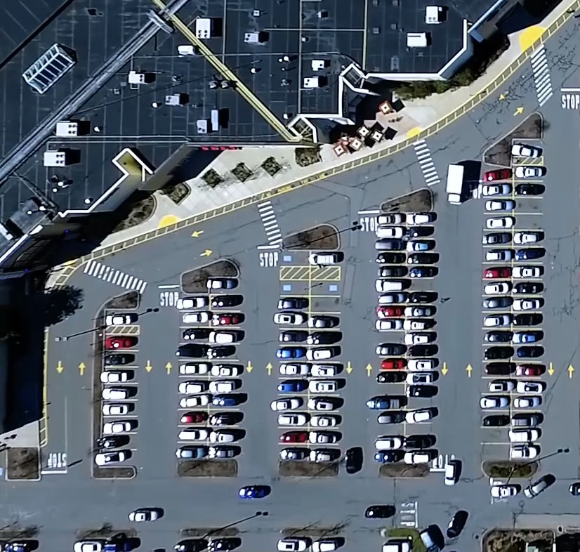
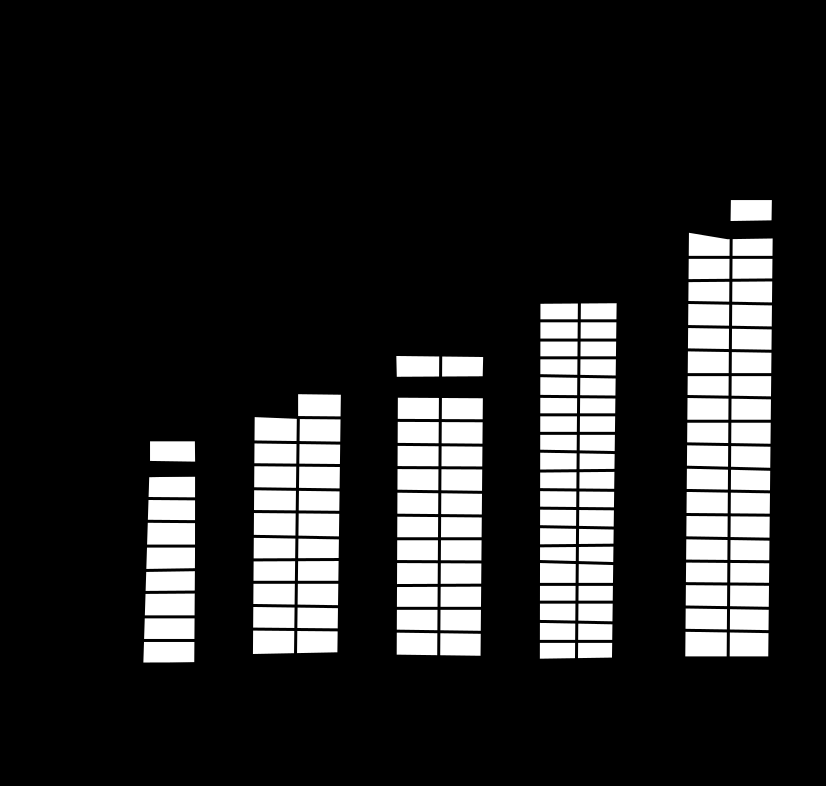
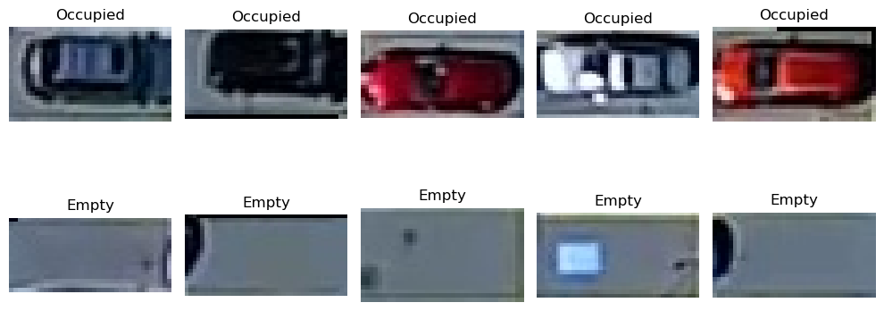

# Parking Space Counter Using VGG-16 and XGBoost

*** It is crucial to reduce the use of personal vehicles in order to mitigate the carbon footprint in our atmosphere.***

## Inspirations
Monitoring and analyzing the occupancy of parking spaces in a parking lot can indeed offer valuable insights into the growth and activity of nearby businesses. However, the high cost associated with installing a dedicated parking count system often deters free and non-gated parking lots from pursuing such solutions. This project aims to explore the feasibility of applying machine learning techniques, such as convolution neural networks, to count parked cars using existing surveillance videos.

## Challenges
In the task of counting the number of cars in a video frame, various approaches such as object detection techniques, object tracking, and object segmentation can be employed. However, the primary challenge lies in differentiating between parked cars and cars that are in motion. Our focus is on identifying and counting the cars that are parked in the designated parking stalls, excluding those that are actively driving or moving within the area.

## Solution
One way to overcome the challenge is by applying a binary mask technique. This involves extracting a video frame and creating a mask that highlights the shapes of each parking stall as white against a black background. By applying the mask, we can focus solely on the designated parking stall areas, allowing for a precise analysis of occupancy. 

#### Frame:


#### Mask:


#### Extracted parking stall samples:


To determine the occupancy status of parking stalls, we can employ machine learning methods utilizing pre-trained models. In this case, the VGG-16 model can be utilized to extract meaningful features from the images of parking stalls. These extracted features can then serve as inputs to an XGBoost model, which can be trained to classify whether a stall is empty or occupied based on the learned patterns. 

#### VGG 16

VGG16 is a deep convolutional neural network architecture consisting of 16 layers, including convolutional and pooling layers, widely known for its strong performance in image classification tasks.

```
Model: "vgg16"
_________________________________________________________________
 Layer (type)                Output Shape              Param #   
=================================================================
 input_1 (InputLayer)        [(None, 32, 32, 3)]       0         
                                                                 
 block1_conv1 (Conv2D)       (None, 32, 32, 64)        1792      
                                                                 
 block1_conv2 (Conv2D)       (None, 32, 32, 64)        36928     
                                                                 
 block1_pool (MaxPooling2D)  (None, 16, 16, 64)        0         
                                                                 
 block2_conv1 (Conv2D)       (None, 16, 16, 128)       73856     
                                                                 
 block2_conv2 (Conv2D)       (None, 16, 16, 128)       147584    
                                                                 
 block2_pool (MaxPooling2D)  (None, 8, 8, 128)         0         
                                                                 
 block3_conv1 (Conv2D)       (None, 8, 8, 256)         295168    
                                                                 
 block3_conv2 (Conv2D)       (None, 8, 8, 256)         590080    
                                                                 
 block3_conv3 (Conv2D)       (None, 8, 8, 256)         590080    
                                                                 
 block3_pool (MaxPooling2D)  (None, 4, 4, 256)         0         
                                                                 
 block4_conv1 (Conv2D)       (None, 4, 4, 512)         1180160   
                                                                 
 block4_conv2 (Conv2D)       (None, 4, 4, 512)         2359808   
                                                                 
 block4_conv3 (Conv2D)       (None, 4, 4, 512)         2359808   
                                                                 
 block4_pool (MaxPooling2D)  (None, 2, 2, 512)         0         
                                                                 
 block5_conv1 (Conv2D)       (None, 2, 2, 512)         2359808   
                                                                 
 block5_conv2 (Conv2D)       (None, 2, 2, 512)         2359808   
                                                                 
 block5_conv3 (Conv2D)       (None, 2, 2, 512)         2359808   
                                                                 
 block5_pool (MaxPooling2D)  (None, 1, 1, 512)         0         
                                                                 
=================================================================
Total params: 14,714,688
Trainable params: 0
Non-trainable params: 14,714,688
_________________________________________________________________

```

#### XGBoost

XGBoost is an optimized gradient boosting framework that utilizes an ensemble of decision tree models, employing a combination of boosting and regularization techniques to achieve high prediction accuracy and handle complex datasets.

```
import xgboost as xgb

params = {
    'objective': 'binary:logistic',  # binary classification
    'eval_metric': 'logloss',  # 
    'eta': 0.1,  # learning rate
    'max_depth': 3,  # maximum depth of each tree
    'subsample': 0.8,  # subsample ratio of the training instances
    'colsample_bytree': 0.8,  # subsample ratio of features when constructing each tree
    'seed': 42  # random seed for reproducibility
}


XGB_model = xgb.XGBClassifier(**params)
```
## Result


## Acknowledgment
The video used in the project was obtained from:
```
https://github.com/zhu-xlab/Busy-parking-lot-dataset---vehicle-detection-in-UAV-video#busy-parking-lot-dataset---vehicle-detection-in-uav-video
```
